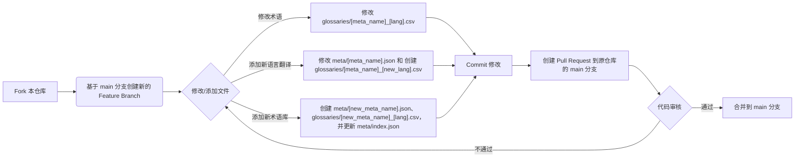

# 贡献指南

欢迎为 Immersive Translate 术语库做出贡献！我们非常感谢社区的支持。

## 贡献流程

我们使用标准的 GitHub Fork & Pull Request 工作流程。



注意：对于添加适配所有语言的情况（`auto`），应在 `langs` 数组中添加 `"auto"`，并创建 `glossaries/[meta_name].csv` 文件（不带语言后缀）。

1.  **Fork** 本仓库到你的 GitHub 账户。
2.  从 `main` 分支创建一个新的 **Feature Branch**，例如 `feature/add-tech-korean` 或 `fix/update-web3-terms`。
3.  在你的 Feature Branch 中进行修改或添加文件。
4.  **Commit** 你的修改。请撰写清晰的 Commit Message。
5.  **Push** 你的 Feature Branch 到你的 Fork 仓库。
6.  创建一个 **Pull Request**，目标是本仓库的 `main` 分支。请在 Pull Request 中详细说明你的修改内容。
7.  我们会尽快审核你的 Pull Request，并在审核通过后将其合并。

## 术语库结构

术语库主要由两部分组成：

*   `meta/` 目录：存放术语库的元数据文件（JSON 格式）。每个文件（例如 `web3.json`）定义了一个术语库，我们称文件名为 `meta_name` （例如 `web3`）。
*   `glossaries/` 目录：存放实际的术语翻译对（CSV 格式）。文件名遵循 `[meta_name]_[lang].csv` 规则，例如 `web3_zh-CN.csv` 对应 `meta/web3.json` 的简体中文术语。若 `meta.json` 中的 `langs` 包含 `"auto"`，则对应的 CSV 文件命名为 `[meta_name].csv`（不带语言后缀），表示该术语适配任何目标语言。
*   `meta/index.json`：公共术语库入口索引。新增术语库时，必须把新的 `meta_name` 作为字符串添加到该数组中，否则该术语库不会出现在公共术语库列表中。

## 如何添加或修改术语

### 修改现有术语

直接编辑对应的 `glossaries/[meta_name]_[lang].csv` 文件或 `glossaries/[meta_name].csv` 文件（适用于 `auto` 语言），修改 `source` 或 `target` 列的内容。

### 添加新的语言翻译

1.  打开对应的 `meta/[meta_name].json` 文件。
2.  将新的语言代码（例如 `ko`）添加到 `langs` 数组中。若要添加适配所有语言的支持，则添加 `"auto"` 到 `langs` 数组。
3.  在 `i18ns` 对象中，为新的语言代码添加对应的 `name` 和 `description` 翻译。注意：`auto` 不需要在 `i18ns` 对象中添加条目。
4.  在 `glossaries/` 目录下，创建新的 CSV 文件：
    - 对于特定语言，命名为 `[meta_name]_[new_lang].csv`（例如 `web3_ko.csv`）
    - 对于适配所有语言的情况，命名为 `[meta_name].csv`（例如 `web3.csv`）
5.  将现有的一种语言的 CSV 文件内容复制到新文件中作为模板。
6.  修改新文件，将 `target` 列翻译成新的目标语言，并将 `tgt_lng` 列更新：
    - 对于特定语言，更新为对应的语言代码
    - 对于适配所有语言的情况（`auto`），将 `tgt_lng` 列设置为空字符串 `""`

### 添加新的术语库

1.  在 `meta/` 目录下创建一个新的 JSON 文件，例如 `meta/mynewglossary.json`。`mynewglossary` 就是这个术语库的 `meta_name`。
2.  参考现有的 JSON 文件结构，填写新术语库的元数据，包括 `id`, `name`, `description`, `author`, `glossary` (应与 `id` 和 `meta_name` 保持一致), `langs` (至少包含一种语言), `i18ns` 等字段。
3.  将新的 `meta_name` 添加到 `meta/index.json` 数组中，例如添加 `"mynewglossary"`。发布脚本会根据该数组生成线上术语库索引。
4.  在 `glossaries/` 目录下，为新术语库创建一个或多个 CSV 文件，例如 `glossaries/mynewglossary_zh-CN.csv`。
5.  按照 CSV 文件格式要求，在新文件中添加术语对。
6.  如果这是某个领域、游戏、产品或网站专用术语库，建议在 `meta/[meta_name].json` 中添加 `matches`，限制术语库的生效网站。若不设置 `matches`，用户启用后该术语库会在所有网站生效。

## CSV 文件格式

*   文件编码：UTF-8。
*   使用逗号 (`,`) 作为分隔符。
*   第一行为表头，必须包含以下三列：`source,target,tgt_lng`。
*   **`source`**: 源语言术语文本。
*   **`target`**: 目标语言术语的翻译文本。
*   **`tgt_lng`**: 该 CSV 文件对应的目标语言代码。
    - 对于特定语言文件（`[meta_name]_[lang].csv`），值应与文件名中的 `[lang]` 部分以及 `meta.json` 中 `langs` 数组内的代码一致。
    - 对于适配所有语言的文件（`[meta_name].csv`），该值应为空字符串 `""`。
*   每一行都应是有效术语对，`source` 和 `target` 不应为空。不要把章节标题、备注、待确认内容（例如 `?`）或说明文字放进 CSV。
*   同一个 CSV 中不应出现重复的 `source`。如果同一个英文术语在不同语境下有不同译法，请拆成更具体的 `source`，或用 `matches` 限定术语库生效范围。
*   请使用 UTF-8 编码，建议保存为 UTF-8 without BOM。

**示例 (`glossaries/web3_zh-CN.csv`):**

```csv
source,target,tgt_lng
Blockchain,区块链,zh-CN
Cryptocurrency,加密货币,zh-CN
Token,代币,zh-CN
...
```

**示例 (`glossaries/web3.csv`):**

```csv
source,target,tgt_lng
Blockchain,区块链,
Cryptocurrency,加密货币,
Token,代币,
...
```

## Meta JSON 文件结构 (`meta/[meta_name].json`)

`meta` 目录下的 JSON 文件定义了每个术语库的属性。

**关键字段说明:**

*   `id` (string): 术语库的唯一标识符，应与文件名 (`meta_name`) 保持一致。
*   `name` (string): 术语库的英文名称（展示用）。
*   `description` (string): 术语库的英文详细描述。
*   `author` (string): 术语库的作者或来源标识。
*   `glossary` (string): 关联的基础术语库名称，应与 `id` 和文件名 (`meta_name`) 保持一致。
*   `suffix` (string, 可选): 版本或其他后缀信息。
*   `matches` (array of strings, 可选): 指定术语库生效的网站匹配规则列表。支持精确域名匹配 (`"twitter.com"`)、通配符域名匹配 (`"*.example.com"`)、完整URL匹配 (`"https://platform.twitter.com/embed*"`) 和全局匹配 (`"*"`、`"*://*/*"`)。如果未指定，术语库将在所有网站生效。注意：`"*.example.com"` 只匹配子域名，不匹配裸域名 `"example.com"`；如果两者都要生效，请同时写入。
*   `langs` (array of strings): 此术语库支持的目标语言代码列表 (例如 `["zh-CN", "zh-TW", "en"]`)。可以包含特殊值 `"auto"`，表示该术语库适配任何目标语言。
*   `i18ns` (object): 包含各个支持语言的本地化信息。
    *   `[lang_code]` (object): 以语言代码作为键。
        *   `name` (string): 该语言下的术语库名称。
        *   `description` (string): 该语言下的术语库描述。
*   `langsHash` 会由发布脚本根据 CSV 内容自动生成，贡献 PR 时不需要手动添加或修改。

**示例 (`meta/web3.json`):**

```json
{
  "id": "web3",
  "name": "Web3 Expert",
  "description": "Specialized in translating Web3 and blockchain content...",
  "author": "immersive",
  "glossary": "web3",
  "matches": [
    "*.crypto.com",
    "opensea.io",
    "https://app.uniswap.org/*"
  ],
 "langs": [
    "zh-CN",
    "zh-TW",
    "auto"
  ],
  "i18ns": {
    "zh-CN": {
      "name": "Web3",
      "description": "Web3术语库，包含加密货币、DeFi、NFT和区块链技术相关术语的中文翻译。"
    },
    "zh-TW": {
      "name": "Web3",
      "description": "Web3術語庫，包含加密貨幣、DeFi、NFT和區塊鏈技術相關術語的繁體中文翻譯。"
    }
  }
}
```

## 代码风格和规范

*   CSV 文件请确保使用 UTF-8 编码。
*   Commit Message 请清晰说明修改意图。
*   Pull Request 请提供充分的说明。

## 提交前检查清单

新增术语库时，请确认：

*   `meta/[meta_name].json` 已创建，且 `id`、`glossary`、文件名三者一致。
*   `meta/index.json` 已加入新的 `meta_name` 字符串。
*   `langs` 中的每个语言都有对应 CSV 文件：
    - `zh-CN` 对应 `glossaries/[meta_name]_zh-CN.csv`
    - `zh-TW` 对应 `glossaries/[meta_name]_zh-TW.csv`
    - `auto` 对应 `glossaries/[meta_name].csv`
*   每个 CSV 的表头是 `source,target,tgt_lng`，且每行的 `tgt_lng` 与文件名和 `langs` 配置一致。
*   CSV 中没有空 `source`、空 `target`、重复 `source`、章节标题、备注或待确认占位内容。
*   领域或网站专用术语库已配置合适的 `matches`，避免在所有网站生效。
*   不需要手动提交 `langsHash`；发布流程会自动生成。
